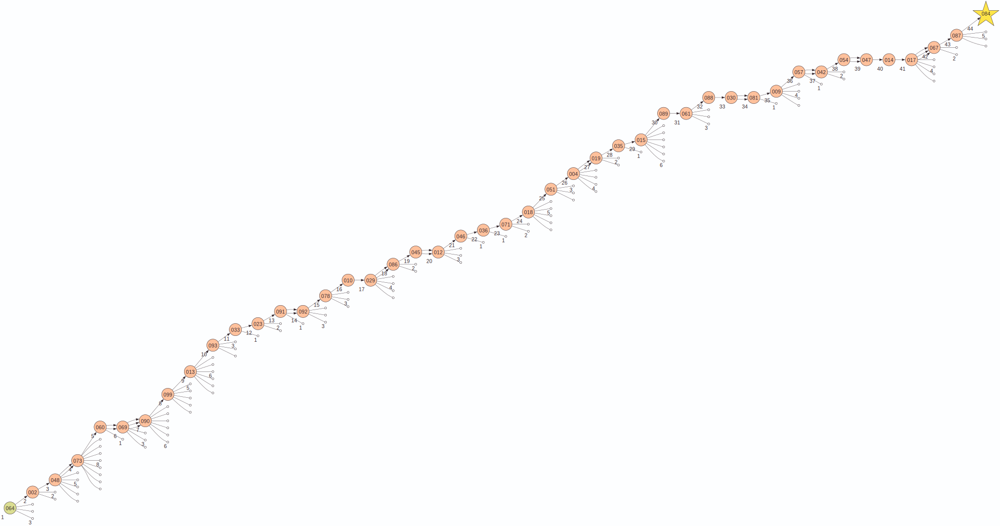

# 🐦‍⬛ SQLab Corbeau


Entraînez-vous à SQL avec cette adaptation du chef-d'œuvre de Henri-Georges Clouzot, _Le Corbeau_ (1943) !


## Principe

Cette base a été générée par [SQLab](https://github.com/laowantong/sqlab) : elle contient à la fois des **données** et des **exercices de SQL** sur ces données.

Les tables-métier (celles sur lesquelles vous travaillerez) sont les suivantes :


<details><summary>Pour référence, le schéma conceptuel correspondant.</summary></details>


Une base SQLab inclut également une **table de messages** : éléments narratifs, explications, énoncés de questions, pistes personnalisées en cas de réponses fausses, enfin solutions et variantes éventuelles.

Chaque message est chiffré par une clé cryptographique distincte (ou **token**).

L'énoncé d'une question vous fournira toujours une formule de calcul de token, p. ex. `, salt_042(sum(A.hash + B.hash) over()) as token`.

Imaginons que votre réponse « brute » consiste en la requête SQL suivante :

```sql
SELECT A.foo
     , B.bar
FROM bizz A
JOIN buzz B ON A.foobar = B.foobar
```

Copiez-collez la formule de token dans la clause `SELECT` :

```sql
SELECT A.foo
     , B.bar
     , salt_042(sum(A.hash + B.hash) over()) as token
FROM bizz A
JOIN buzz B ON A.foobar = B.foobar
```

Exécutez cette requête. La table résultante comportera une colonne `token` avec la même valeur sur toutes les lignes. Insérez cette valeur dans les parenthèses de la requête de déchiffrement suivante :

```sql
SELECT decrypt()
```

Trois cas peuvent alors se présenter :
- 🔴 Votre réponse est complètement fausse, et le système ne voit pas comment vous aider à la corriger.
- 🟠 Votre réponse est presque juste, et le système vous donne une piste.
- 🟢 Votre réponse est juste, et le système vous félicite, affiche la correction officielle et, le cas échéant, l'épisode suivant.

## Récupération de la base `corbeau`

La base de données est actuellement disponible pour MySQL 8 ou supérieur : [téléchargez mysql/dump.sql](https://raw.githubusercontent.com/laowantong/sqlab_corbeau/output/dump.sql) (clic droit / « Télécharger le fichier lien sous… ») et exécutez :

```bash
mysql -u username -p < dump.sql
mysql -u username -p corbeau
```

## Lancement

Pour accéder au premier épisode de l'aventure, exécutez :

```sql
SELECT decrypt(292)
```

L'aventure compte 44 épisodes, à travers lesquels vous progresserez en composant des requêtes de difficulté progressive.



Le plan de la base s'interprète ainsi :

- Chaque sommet représente une question.
- Les verts sont des points d'entrée : ils portent un numéro qui sert aussi de token d'accès.
- Les rouges sont également numérotés, mais ne peuvent être atteints qu'en ayant suivi un chemin d'arcs depuis un sommet vert, autrement dit, en ayant résolu toutes les questions précédentes.
- Certains arcs sont multiples, ce qui signifie que la solution admet une ou plusieurs variantes (qui vous seront systématiquement présentées dans la correction).
- Les petits sommets blancs représentent les erreurs pour lesquelles une indication a été prévue dans la base. Comme la plupart correspondent à des erreurs réellement commises par des étudiants, vous pouvez considérer leur nombre comme plus ou moins proportionnel à la difficulté.
- Quand vous arrivez à une étoile, vous avez fini soit un exercice, soit l'aventure complète !


Bonnes requêtes !

## Crédits

- Henri-Georges Clouzot et Louis Chavance sont les auteurs du scénario original du film _Le Corbeau_ (1943) réalisé par Clouzot.
- Aristide Grange (université de Lorraine, laboratoire LCOMS) est l'auteur :
  - de son adaptation pour SQLab;
  - de [SQLab](https://github.com/laowantong/sqlab), l'outil qui a servi à générer la base;
  - de [Mocodo](https://mocodo.net) pour les diagrammes relationnel et conceptuel.
